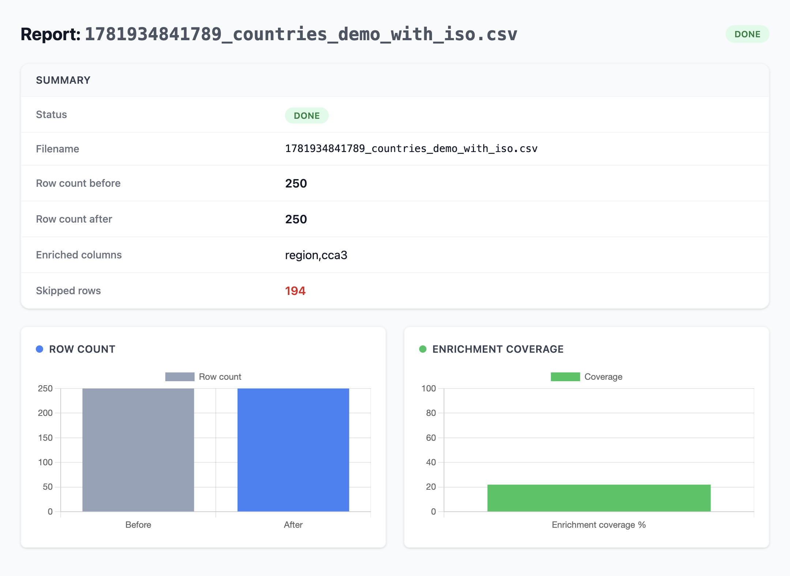

# csv-cleaner

Hono + TypeScript ETL API. Uploads CSV → validates → cleans → enriches → serves chart report.

## Pipeline

```
POST /upload
    │
    ▼
validator.ts ── schema checks: nulls, type mismatches, duplicate rows, row count
    │
    │  invalid? ──► fail fast, job marked "failed", clean/enrich are skipped
    ▼
cleaner.ts ── DuckDB SQL: trim, normalize dates to ISO 8601, lowercase emails, dedupe, empty string → NULL
    │
    ▼
enricher.ts ── optional join against country reference data if a country column is detected
    │
    ▼
job.ts ── job metadata, status, and row counts saved to Postgres
    │
    ▼
GET /report/:id ── HTML report with summary table and Chart.js bar charts
```

Validation gates the pipeline: a CSV that fails validation is marked `failed` immediately and never reaches the clean or enrich stages.

## Setup

1. Copy `.env.example` to `.env` and adjust if needed:
   ```bash
   cp .env.example .env
   ```
2. Start Postgres:
   ```bash
   docker compose up -d
   ```
3. Install dependencies:
   ```bash
   npm install
   ```
4. Run in dev mode:
   ```bash
   npm run dev
   ```

`npm run dev` and `npm test` both load environment variables from `.env` via `--env-file=.env`, so step 1 is required before either command will pick up your config.

## Environment variables

Copy `.env.example` to `.env` and fill in your own values — see the Setup section above.

| Variable            | Description                             |
| ------------------- | --------------------------------------- |
| `DATABASE_URL`      | Postgres connection string used by `pg` |
| `PORT`              | Port the Hono server listens on         |
| `POSTGRES_USER`     | Postgres DB username                    |
| `POSTGRES_PASSWORD` | Postgres DB user password               |

## Testing

```bash
npm test
```

Requires Postgres running (`docker compose up -d`) since the repository tests hit a real database. `npm test` loads `.env` automatically via `--env-file=.env`.

## Usage

### Health check

```bash
curl http://localhost:3000/health
```

Response:

```json
{ "status": "ok" }
```

### Upload a CSV

```bash
curl -X POST -F "file=@path/to/your.csv" http://localhost:3000/upload
```

Success response (HTTP 200):

```json
{ "jobId": 1, "status": "done", "fileName": "1718999999999_your.csv" }
```

If validation or any later pipeline stage fails, the endpoint returns **HTTP 500** with an `errorMessage` field instead:

```json
{
  "jobId": 2,
  "status": "failed",
  "fileName": "1718999999999_bad.csv",
  "errorMessage": "validation failed: [...]"
}
```

### View the report

```bash
curl http://localhost:3000/report/1
```

Or open `http://localhost:3000/report/1` in a browser for the full Tailwind + Chart.js report.



> Sample report showing before/after row counts and country enrichment coverage.

## Enrichment notes

Country enrichment fetches reference data from `raw.githubusercontent.com/mledoze/countries` (a static JSON dataset). The API originally targeted `restcountries.com`, but that service is currently deprecated/broken, so the enricher was switched to the mledoze/countries dataset instead. Enrichment is entirely optional — if no country column is detected in the CSV, or if the country data fetch fails at startup, enrichment is skipped gracefully and the rest of the pipeline proceeds unaffected.
